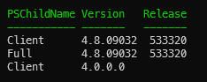

For current dotnet you can very simply see installed runtime and SDK by using `dotnet --info`, but checking the old .NET Framework is more difficult.

## Quick solution

Use following command to check installed versions of .NET framework on windows system

``` powershell
gci 'HKLM:\SOFTWARE\Microsoft\NET Framework Setup\NDP' -recurse | gp -name Version,Release -EA 0 |where { $_.PSChildName -match '^(?!S)\p{L}'} | select PSChildName, Version, Release
```

You will get result as below


