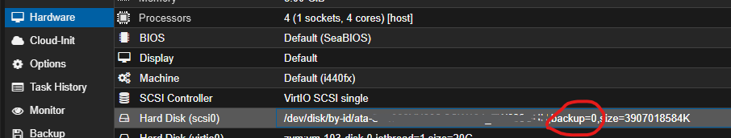
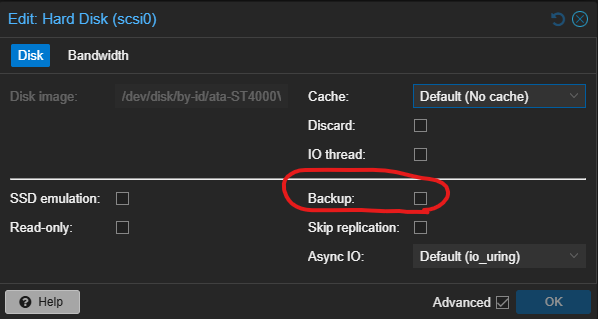

This guide will passthrough physical disk(s) into virtual machine and use it like normal disk

> This guide is use partial content from original to summarize as my understand and remember
> **Source:** [Proxmox Wiki](https://pve.proxmox.com/wiki/Passthrough_Physical_Disk_to_Virtual_Machine_(VM))

## List the physical disks

In our case we will use hdd-id to identify disk, using `lsblk` to list your disks installed in proxmox host

```shell
find /dev/disk/by-id/ -type l|xargs -I{} ls -l {}|grep -v -E '[0-9]$' |sort -k11|cut -d' ' -f9,10,11,12
```

Will get output like 

```shell
/dev/disk/by-id/ata-ST8000DM004-2CX188_ZCT1DNY1 -> ../../sda
/dev/disk/by-id/wwn-0x5000c500c35cd719 -> ../../sda
/dev/disk/by-id/usb-Generic_STORAGE_DEVICE-0:0 -> ../../sdb
/dev/disk/by-id/usb-JMicron_Generic_0123456789ABCDEF-0:0 -> ../../sdc
/dev/disk/by-id/ata-ST2000DX001-1CM164_Z1E783H2 -> ../../sdd
/dev/disk/by-id/wwn-0x5000c500661eeebd -> ../../sdd
```

## Assign disk to VM

After note your disk by-id from previous step, just assign it to your virtual machine

```shell
qm set [vmid] -scsi[0] /dev/disk/by-id/wwn-0x5000c500661eeebd
```

> Replace your [vmid] as your VM and [0] replace by running number of `scsi` on your VM (start with 0)

## Check result

after assign disk to VM, you will see disk in `Hardware`



(Optional) Mostly, I will disabled backup for physical disk (due to private reason) by uncheck `backup` option


