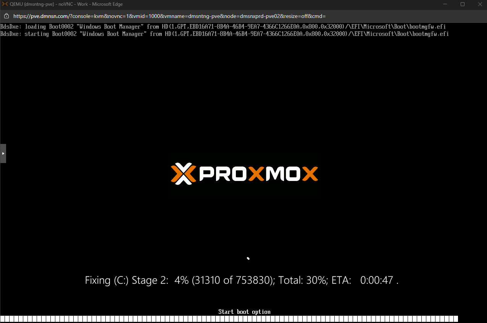

By default, Windows is installed with a recovery partition, mostly at the last partition on disk.

When you need to shrink or expand your disk, you will be stuck with a recovery partition that cannot be moved.

This guide will help you to move, shrink, expand your windows partition with disk management tools bundled in Windows.

> ⚠️ **Caution:** Partition management has some risk to lose or not recover your data. Please backup before starting the process.

## Check current partition

`Right click` on Windows and select `Disk Management`, you will see all disks installed in your system. Select `Volume (C:)`; it will highlight the partition and disk that currently has Windows installed.


As shown in the image, the recovery and other partitions are blocked at the end of the disk. This prevents us from moving, shrinking, or expanding the Windows partition.

Next step, we need some step to complete our goal

- Remove recovery partition
- Move/Shrink/Expand Windows partition
- Re-Create recovery partition

## Remove recovery partition

To remove partition, we will use `diskpart` to remove partition with step below

```powershell
# Use diskpart to manage partition
diskpart
```

Prompt will change to `DISKPATH>`

```powershell
Microsoft DiskPart version 10.0.26100.1150

Copyright (C) Microsoft Corporation.
On computer: DMSNTNG-PVE

DISKPART>
```

Check and delete your current recovery partition:

```powershell
list disk
# where `#` is the disk needing the recovery partition removed
select disk #
list partition
# where `#` is the recovery partition
select partition #
# to force deletion of the recovery partition
delete partition override
```

## Resize your partition

After removing the recovery partition, you will be able to resize or move the partition as needed.

- Expand/Shrink/Move the disk using **Disk Management**, leaving ~1024 MB at the end of the drive for recreating the recovery partition

If you have some trouble managing partitions, refer to the `Troubleshooting` section for more info

## Re-Create Recovery partition

After managing the partition as desired, the next step is to re-create the recovery partition.

### Create partition and copy recovery image

Create new partition (<=1GB) and assign to `R:` drive letter for temporary use, create `WinRE` folder structure:

```powershell
mkdir R:\Recovery
mkdir R:\Recovery\WindowsRE
```

Copy recovery image to the partition

```powershell
COPY C:\Windows\System32\Recovery\winre.wim R:\Recovery\WindowsRE\
```
If cannot find `winre.wim` see `Troubleshooting` section.

### Mark partition as `Recovery`

Use `diskpart` to set GUID for the partition

```powershell
list disk
# where `#` is the disk with the recovery partition
select disk #
list partition
# where `#` is the new recovery partition
select partition #

# For GPT disks run
set id=de94bba4-06d1-4d40-a16a-bfd50179d6ac
gpt attributes=0x8000000000000001

# For MBR disks, run
set id=27
```

### Set WinRE to new image

Disable current `WinRE` and set new WinRE image

```powershell
reagentc /disable
# set the image
reagentc /setreimage /path R:\Recovery\WindowsRE\
# Re-enable the WinRE environment
reagentc /enable
```

### Verify and remove assign drive letter

After re-enable, you can check recovery configuration by using

```powershell
reagentc /info
```

Example output:

```powershell
Windows Recovery Environment (Windows RE) and system reset configuration
Information:

    Windows RE status:         Enabled
    Windows RE location:       \\?\GLOBALROOT\device\harddisk0\partition4\Recovery\WindowsRE
    Boot Configuration Data (BCD) identifier: 820361a0-efb2-11ef-8321-cafe74c0ef77
    Recovery image location:
    Recovery image index:      0
    Custom image location:
    Custom image index:        0

REAGENTC.EXE: Operation Successful.
```

Now you can remove drive letter

```powershell
list disk
# where `#` is the disk with the recovery partition
select disk #
list volume
# where `#` is the new recovery volume
select volume #
remove letter=R
```

## Troubleshooting

Some steps have issues; this will help with common issues we often find

### Cannot shrink a volume beyond the point

The reason why Windows won’t let you shrink the volume is as the message shown in Disk Management suggested, because there are immovable system files at the very end of the volume, as this screenshot from utility shows us. there are multiple things you could try to work this around.

#### Disable System Restore

Go to `Settings -> About -> Advanced system settings -> System Protection` and disable system protection for drive to be shrink


> ℹ️ You can enable this later after complete shrink partition

#### Disable `pagefile`

`pagefile` is virtual memory by using disk to caching data, it very helpful on system with low RAM


### (Optional) Using 3rd software

Using 3rd software to resize partition if stuck with partition resizing process

In this case using [AOMEI Partition Assistant Standard](https://www.aomeitech.com/pa/standard.html)

Start program and select partition need to resize, specified new size as need


After confirm, program will ask for restart (because we're resizing OS partition), select PreOS mode

It will automatically restart into PreOS mode and start resizing your partition


When resizing process completed, system will restart again and Windows will start disk scan because disk has changed to ensure OS can run normally



### Cannot find `winre.wim` image

If you don't find `winre.wim` in System32

- Download Windows ISO from [Microsoft Download](https://www.microsoft.com/th-th/software-download/windows11)
- Mount ISO image
- Open `\sources\install.wim` with `7-Zip`
    - Extract `winre.wim` from `\Windows\System32\Recovery\winre.wim` inside `install.wim` image
    
- Copy it to your recovery partition.

## References

- [Recreating and enabling the recovery environment (WinRE) from a recovery partition](https://learn.microsoft.com/en-us/answers/questions/4027919/recreating-and-enabling-the-recovery-environment-)
